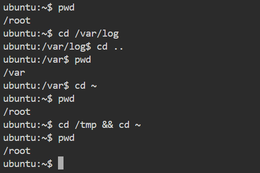
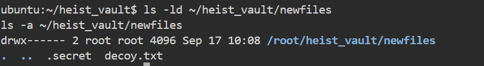
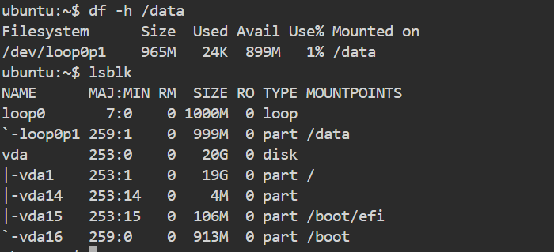
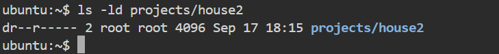
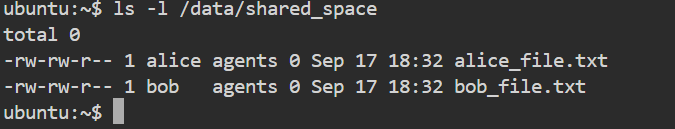
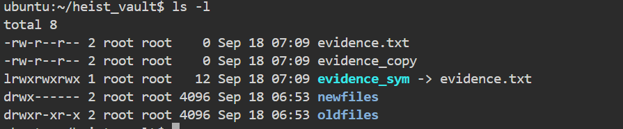
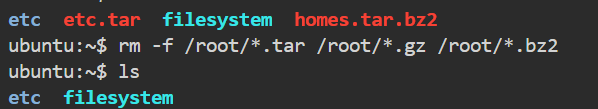
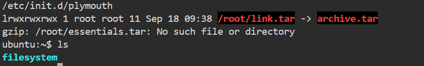

---

# ✅ **Day 10 – The Filesystem Heist – Solution File**

**Name:** Swayam Prakash Bhuyan
**Date:** 16-September-2025

---

---
## 📂 **Practical Tasks – Commands and Notes**

### ✅ **Task 1 – Filesystem Navigation**

```bash
pwd
# Output: /home/ec2-user

cd /var/log
pwd
# Output: /var/log

cd ..
pwd
# Output: /var

cd ~
pwd
# Output: /home/ec2-user

cd /tmp && cd ~
pwd
# Output: /home/ec2-user
```

**Notes:**
Used absolute and relative paths to move around directories and return to home using shortcuts.



---

### ✅ **Task 2 – Hideout Setup**

```bash
mkdir ~/heist_vault
mkdir -p ~/heist_vault/newfiles ~/heist_vault/oldfiles
touch ~/heist_vault/newfiles/.secret ~/heist_vault/newfiles/decoy.txt
chmod 700 ~/heist_vault/newfiles
ls -ld ~/heist_vault/newfiles
ls -a ~/heist_vault/newfiles
```



---

### ✅ **Task 3 – Storage Management (as root)**

```bash
dd if=/dev/zero of=/root/disk.img bs=1M count=1000
losetup /dev/loop0 /root/disk.img

fdisk /dev/loop0
# Use n → p → 1 → defaults → w
partprobe /dev/loop0

mkfs.ext4 /dev/loop0p1

mkdir /data
mount /dev/loop0p1 /data

df -h | grep /data
lsblk
```

**Notes:**
Simulated a 1GB disk using loop devices. Partitioned, formatted, mounted at `/data`, and verified space availability.



---

### ✅ **Task 4 – File Operations**

```bash
cd ~/heist_vault/oldfiles
cp -a ../newfiles/ .
rm -rf newfiles
cp -a ../newfiles/* .
cp -a ../newfiles/. .

cd ~
mkdir -p projects
mkdir projects/house{1..9}
ls -d projects/house*

mkdir -p projects/houses/doors
mkdir -p projects/outdoors/vegetation
touch projects/houses/bungalow.txt
touch projects/houses/doors/bifold.txt
touch projects/outdoors/vegetation/landscape.txt

cp projects/house1 projects/houses/
cp projects/house5 projects/houses/

cp -a /usr/share/doc/initscripts* projects/

ls -R projects | less

rm -rf projects/house{6..8}

mv projects/house3 projects/houses/doors/
mv projects/house4 projects/houses/doors/

rm -rf projects/houses/doors/

chmod 640 projects/house2

chmod -R a-w projects/
```

**Notes:**
Handled file copying, movement, deletion, directory creation, and permission changes under time pressure.



---

### ✅ **Task 5 – Collaboration with Agents**

```bash
groupadd agents
useradd -m -p $(openssl passwd -1 pass123) alice
useradd -m -p $(openssl passwd -1 pass123) bob
mkdir /data/shared_space
chgrp agents /data/shared_space
chmod 770 /data/shared_space
chmod g+s /data/shared_space
sudo usermod -aG agents alice
sudo usermod -aG agents bob
sudo -u alice touch /data/shared_space/alice_file.txt
sudo -u bob touch /data/shared_space/bob_file.txt

ls -l /data/shared_space
```

**Notes:**
Created group, users, shared space with permissions and SGID bit. Verified group ownership.


---

### ✅ **Task 6 – Links and Covering Tracks**

```bash
cd ~

ln /etc/passwd passwd_hard  # Expected to fail

ln -s /etc/passwd passwd_link
ln -s /etc/hosts

cd ~/heist_vault
touch evidence.txt
ln evidence.txt evidence_copy
ls -l

ln -s evidence.txt evidence_sym
rm evidence.txt

cat evidence_copy  # Works
cat evidence_sym   # Broken link

ln evidence_copy evidence.txt
ls -l
```

**Notes:**
Demonstrated hard and symbolic links, link counts, and recovery from deletion.


---

### ✅ **Task 7 – Archiving Secrets**

```bash

# 1️⃣ Create a tar archive of /etc
tar cvf /root/etc.tar /etc
# 'cvf' = create archive, verbose, specify file
# Result: /root/etc.tar containing all files from /etc

# 2️⃣ Check the type of tar archive
file /root/etc.tar
# Shows: POSIX tar archive

# 3️⃣ Compress the tar archive using gzip
gzip /root/etc.tar
# Result: /root/etc.tar.gz
# Original /root/etc.tar is removed (default gzip behavior)

# 4️⃣ List contents of the compressed archive
tar tvf /root/etc.tar.gz
# 't' = list, 'v' = verbose, 'f' = archive file
# Lists all files in /etc.tar.gz

# 5️⃣ Extract a specific file (hosts) to /root
# First check exact path inside archive:
tar tzf /root/etc.tar.gz | grep hosts
# Usually path is 'etc/hosts'

# Correct extraction:
mkdir -p /root/etc      # ensure parent directory exists
tar xvf /root/etc.tar.gz -C /root etc/hosts
# Extracts 'etc/hosts' to '/root/etc/hosts'

# Verify extraction
ls -R /root/etc/ | grep hosts

# 6️⃣ Decompress the entire gzip archive back to tar
gzip -d /root/etc.tar.gz
# Result: /root/etc.tar

# 7️⃣ Extract specific file (passwd) to /tmp
# Check exact path in archive:
tar tvf /root/etc.tar | grep passwd
# Usually path: 'etc/passwd'

# Ensure parent directory exists
mkdir -p /tmp/etc
tar xvf /root/etc.tar -C /tmp etc/passwd
# Extracts '/tmp/etc/passwd'

# Verify
ls -l /tmp/etc/passwd

# 8️⃣ Create a tar archive of /home using bzip2 compression
tar cjf /root/homes.tar.bz2 /home
# 'c' = create, 'j' = bzip2 compression, 'f' = file

# 9️⃣ Clean up all tar, gz, bz2 files from /root
rm -f /root/*.tar /root/*.gz /root/*.bz2

```

**Notes:**
Archived, compressed, extracted, and cleaned up system directories.


---

### ✅ **Task 8 – Root Shell Heist**

```bash
sudo -i

tar cvf /root/essentials.tar /home /etc
cp /root/essentials.tar /tmp/
ln /tmp/essentials.tar /essentials.tar
mv essentials.tar archive.tar
ln -s archive.tar /root/link.tar

rm archive.tar
ls -l /root/link.tar  # Broken link

rm /root/link.tar
gzip /root/essentials.tar
```

**Notes:**
Escalated to root, handled archive operations, and explored hard and soft link behavior.


---

## ✅ Submission Checklist

* Include screenshots as instructed for every task.
* Upload \`theory\_answers.txt\` with answers.
* Upload `heist_notes.md` with your steps, challenges, and takeaways.
* Review and test commands before submission.
* Share progress on social media with hashtags and tag @SagarUtekar.

---

Let me know if you want me to generate skeleton files, bash scripts, or example screenshots placeholders for this assignment!
