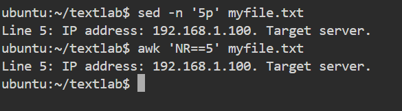
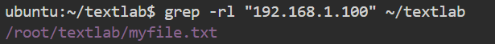
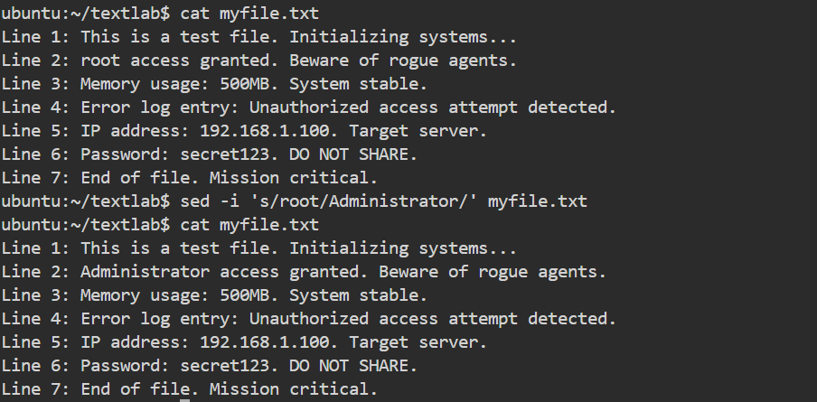
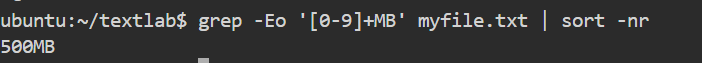
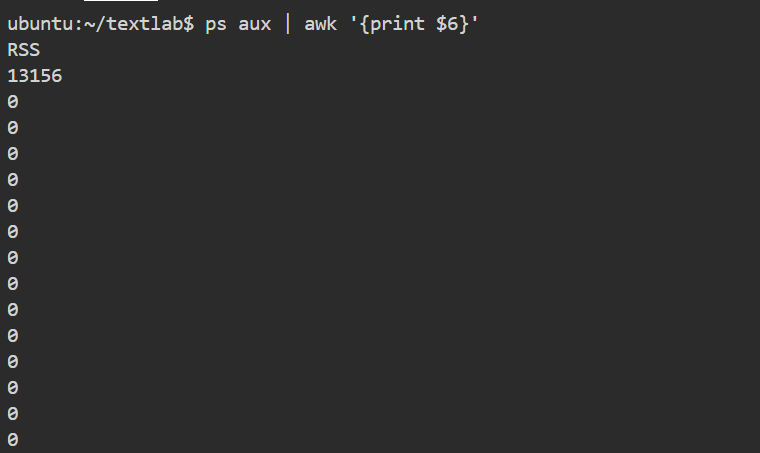
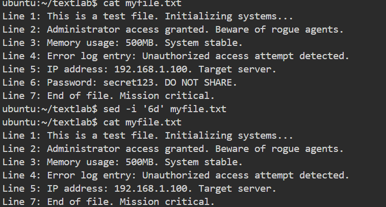
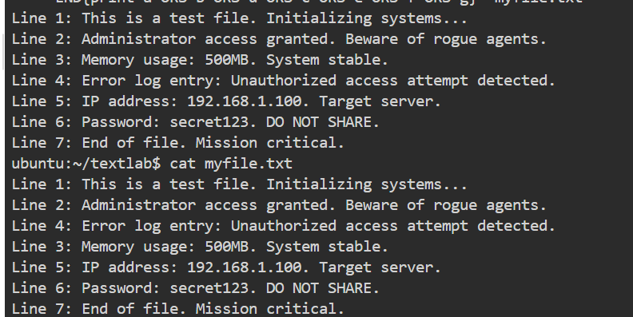
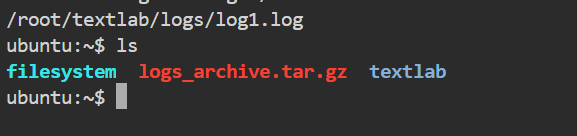
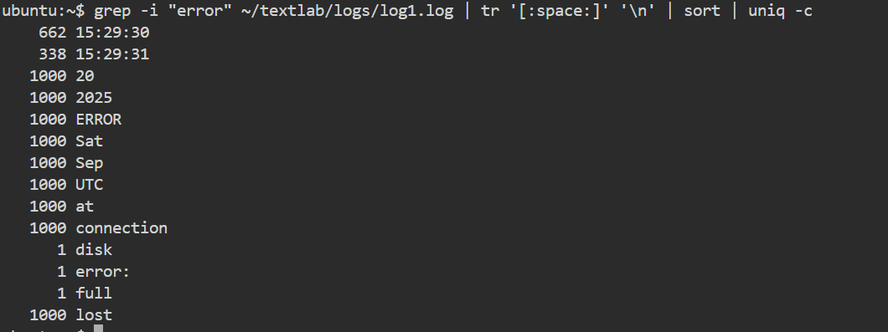
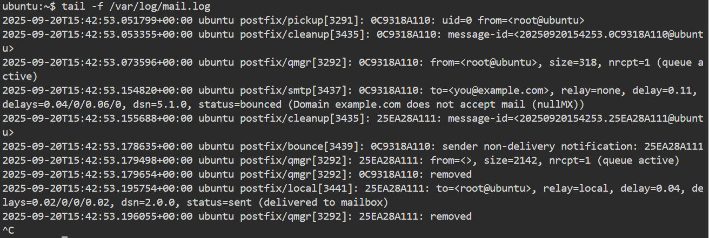

---

# ✅ Daily DevOps + SRE Challenge Series – Season 2

## Day 11: The Text File Takedown – Wrangle Logs and Configs Like a Pro

### 📂 Base Setup

```bash
mkdir ~/textlab
cd ~/textlab
cat << EOF > myfile.txt
Line 1: This is a test file. Initializing systems...
Line 2: Administrator access granted. Beware of rogue agents.
Line 3: Memory usage: 500MB. System stable.
Line 4: Error log entry: Unauthorized access attempt detected.
Line 5: IP address: 192.168.1.100. Target server.
Line 6: Password: secret123. DO NOT SHARE.
Line 7: End of file. Mission critical.
EOF
```

---

## 🧩 Core Skills Training

### 1. Decoding the Intelligence

```bash
sed -n '5p' myfile.txt
awk 'NR==5' myfile.txt
```



---

### 2. Hunting the Target

```bash
grep -rl "192.168.1.100" ~/textlab
```



---

### 3. Reversing the Sabotage

```bash
sed -i 's/root/Administrator/' myfile.txt
```



---

### 4. Memory Optimization

```bash
grep -Eo '[0-9]+MB' myfile.txt | sort -nr
```



---

### 5. System Recon

```bash
ps aux | awk '{print $6}'
```



---

### 6. Deleting Sensitive Info

```bash
sed -i '6d' myfile.txt
```



---

## 🎯 Advanced Missions
```bash 
# Create lab directory
mkdir -p ~/textlab/logs

# Create a sample text file for editing
cat > ~/textlab/myfile.txt <<'EOF'
Line 1: This is a test file. Initializing systems...
Line 2: Administrator access granted. Beware of rogue agents.
Line 3: Memory usage: 500MB. System stable.
Line 4: Error log entry: Unauthorized access attempt detected.
Line 5: Finalizing mission-critical protocols.
EOF

# Create multiple log files (mix of small and large)
echo "error: disk full" > ~/textlab/logs/log1.log
for i in {1..500}; do echo "ERROR connection lost at $(date)" >> ~/textlab/logs/log1.log; done

echo "This is a small harmless log" > ~/textlab/logs/log2.log
dd if=/dev/urandom of=~/textlab/logs/log3.log bs=1M count=2  # 2MB random log file
```

### 1. Swapping Intel

```bash
#sed '3{h;d};4{G}' myfile.txt > tmp && mv tmp myfile.txt
#sed -n '1,2p;4p;3p;5,$p' myfile.txt > tmp && mv tmp myfile.txt
awk 'NR==3{third=$0; next} NR==4{print $0; print third; next} {print}' myfile.txt > tmp
mv tmp myfile.txt
```



---

### 2. Archiving Enemy Logs

```bash
find ~/textlab/logs -name "*.log" -size +1M -print
tar -czvf logs_archive.tar.gz ~/textlab/logs/log1.log
```



---

### 3. Finding Patterns

```bash
grep -i "error" ~/textlab/logs/log1.log | tr '[:space:]' '\n' | sort | uniq -c
```



---

### 4. Alerting the Team

```bash
grep --color=always -r "password" ~/textlab
grep -r "password" ~/textlab | mail -s "⚠️ ALERT: Password Found" you@example.com
```



---

