---

# Daily DevOps + SRE Challenge Series – Season 2

## Day 12: The Process Power-Up – Command Your Linux System Like a Pro

---

## Practical Tasks: Operation Server Rescue – **Solutions**

### 🔹 Setup the Crisis

#### 1. Create a Workspace

```bash
mkdir ~/processlab
cd ~/processlab
```

✅ Directory created successfully.

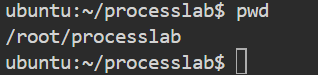

---

#### 2. Simulate Server Stress

* **CPU-intensive script**:

```bash
cat << 'EOF' > cpu_hog.sh
#!/bin/bash
exec -a cpu_hog bash -c 'while true; do :; done'
EOF

chmod +x cpu_hog.sh
```

* **Memory-heavy script**:

```bash
cat << 'EOF' > mem_hog.sh
#!/bin/bash
exec -a mem_hog python3 -c 'while True: a = [0] * 1000000'
EOF

chmod +x mem_hog.sh

```

* **Sleep script**:

```bash
cat << 'EOF' > sleeper.sh
#!/bin/bash
exec -a sleeper sleep 3600
EOF

chmod +x sleeper.sh
```

✅ Scripts created and made executable.

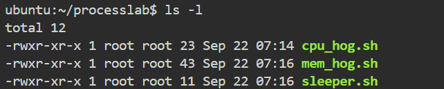

---

#### 3. Install Tools (if needed)

```bash
sudo apt install -y python3 procps sysstat
```

✅ Required tools installed.

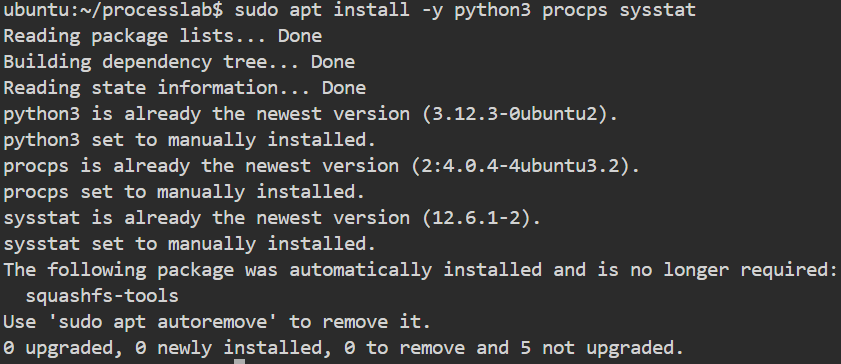

---

### 🔹 Stabilize the Server

#### Assess the Load

1. **Check Load Averages**

```bash
uptime > ~/processlab/load.txt
```

2. **Note CPU Cores**

```bash
lscpu > ~/processlab/cpu_info.txt
```

3. **Compare load vs cores** – Load average above number of CPU cores means stress.

✅ Load data and CPU info captured.

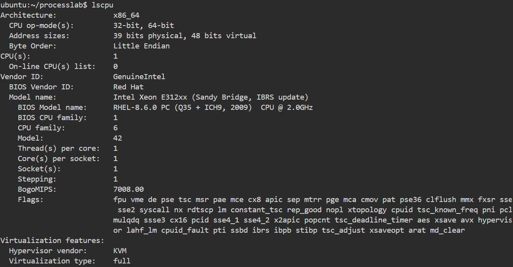

---

#### Survey Running Processes

1. **List All Processes**

```bash
ps aux > ~/processlab/all_processes.txt
```

2. **List Processes Sorted by User**

```bash
ps aux --sort=user >> ~/processlab/all_processes.txt
```

3. **Show Custom Columns**

```bash
ps -e -o pid,user,group,vsz,rss,comm > ~/processlab/custom_processes.txt
```

✅ Process snapshots saved.

all_process.txt
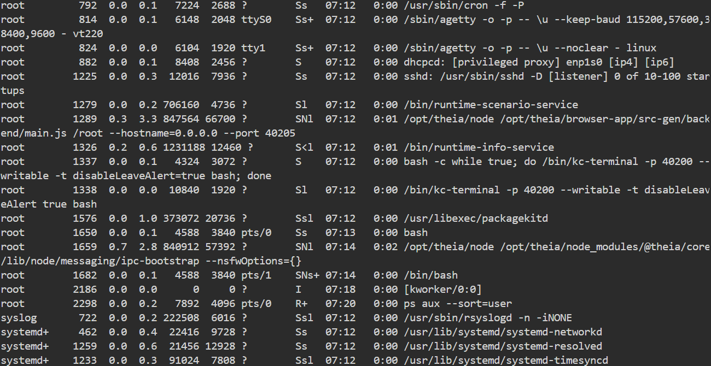

custom_processes.txt
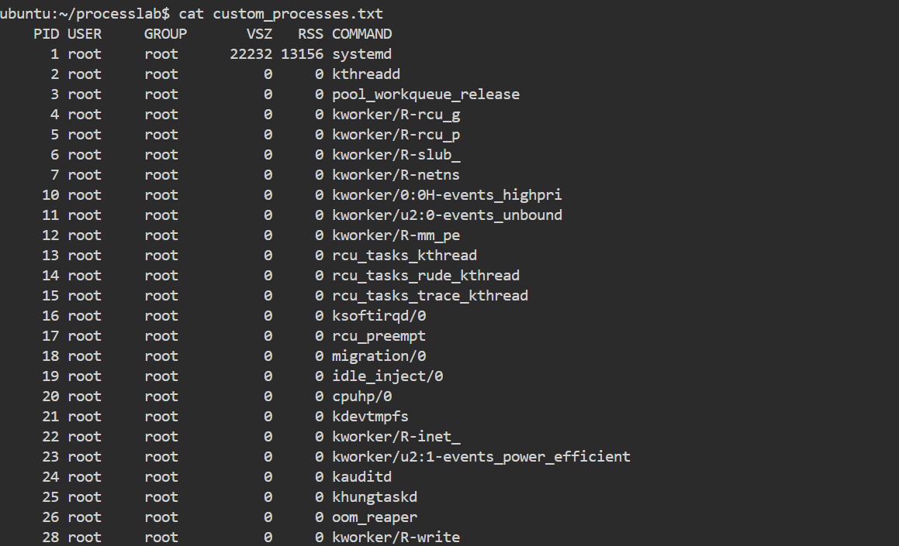

---

#### Launch Rogue Processes

```bash
./cpu_hog.sh &
./mem_hog.sh &
./sleeper.sh &
./cpu_hog.sh
```

(Suspend foreground job with `Ctrl+Z`)

✅ Rogue processes started.

---

#### Manage Jobs

```bash
jobs        # list jobs
bg %1       # resume stopped job
fg %1       # bring sleeper.sh to foreground
Ctrl+C      # terminate sleeper.sh
jobs        # confirm
```

✅ Foreground & background jobs managed.

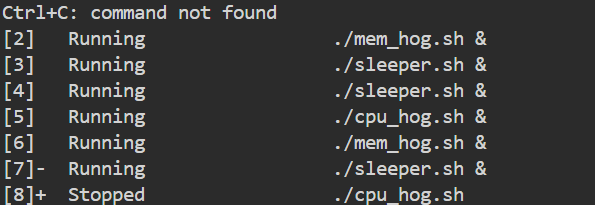

---

#### Monitor in Real-Time

```bash
top
```

* Press `P` to sort by CPU.
* Press `M` to sort by memory.
* Kill mem\_hog.sh inside top using `k + <PID> + 15`.
* Quit with `q`.

✅ mem\_hog.sh terminated safely.

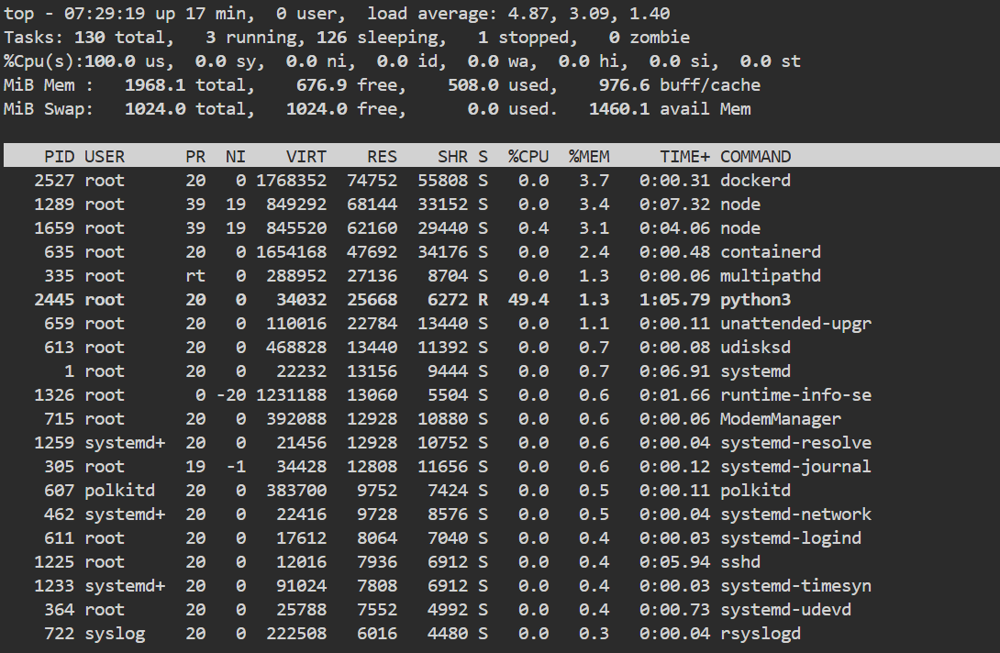

---

#### Adjust Priorities

1. Find PID of cpu\_hog.sh:

```bash
ps aux | grep cpu_hog
jobs -l
```

2. Lower priority:

```bash
renice 5 -p <PID>
```


3. Increase priority (requires sudo):

```bash
sudo renice -5 -p <PID>
```


4. Verify:

```bash
ps -lp <PID> > ~/processlab/priority.txt
```

✅ Priority adjusted successfully.

---

#### Trace Process Hierarchy

```bash
ps fax | grep -B5 cpu_hog > ~/processlab/hierarchy.txt
```

✅ Process hierarchy captured.

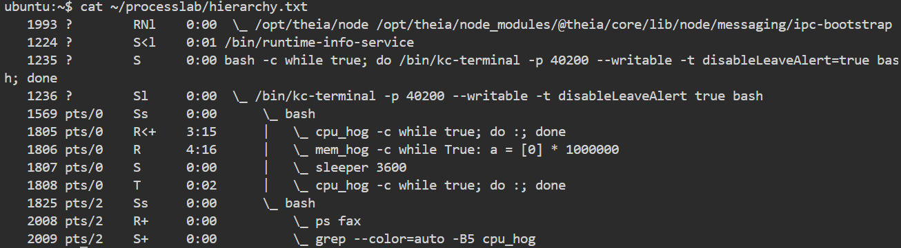

---

#### Clean Up Stragglers

```bash
killall -15 cpu_hog mem_hog sleeper
ps aux | grep -E 'cpu_hog|mem_hog|sleeper'
```

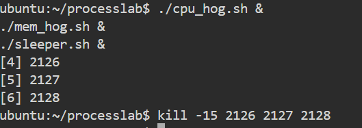

Check & kill:

```bash
ps aux | grep cpu_hog
#killall -15 cpu_hog.sh
kill -15 $(pgrep -f cpu_hog)
ps aux | grep cpu_hog
```

✅ All cpu\_hog.sh processes terminated.


---

#### Final Sweep

```bash
uptime >> ~/processlab/load.txt
#killall -9 sleeper.sh
kill -9 $(pgrep -f sleeper)
ps aux > ~/processlab/final_processes.txt
```

✅ Final cleanup complete.

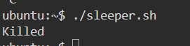

---
