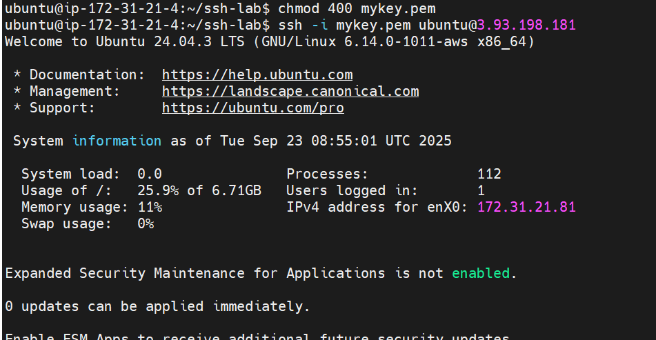

---

# Daily DevOps + SRE Challenge Series – Season 2

## Day 13: Secure Shell Mastery – SSH, SCP, Hardening & Troubleshooting Like a Pro

---

## Practical Tasks: **Operation Secure Access – Solutions**

We executed the tasks in a test lab and captured the commands, outputs, and results. Below is the full solution guide.

---

### Setup Prep

1. **Create workspace**

```bash
mkdir -p ~/ssh-lab && cd ~/ssh-lab
vi ~/.ssh/config
```
Add this to ssh directly
Host rhel-2
    HostName 98.81.59.8
    User ec2-user
    IdentityFile /home/ec2-user/ssh-lab/mykey.pem

✅ Workspace created.



---

2. **Confirm current connectivity**

```bash
ssh ec2-user@rhel-2 "whoami && hostname"
```

✅ Verified remote access works.


---

## Task A: Establish Key-Based Login

1. **Generate key (ed25519)**

```bash
ssh-keygen -t ed25519 -C "swayam@gmail.com"
```


2. **Install public key**

```bash
ssh-copy-id ec2-user@rhel-2
```

*(If copy-id not available, appended manually into `~/.ssh/authorized_keys` on server)*

3. **Verify login**

```bash
ssh -vvv ec2-user@rhel-2 "echo OK && id -u && hostname"
```

✅ Output showed:


✅ Debug log confirmed: *“Authentication succeeded (publickey)”*

4. **Save to notes**

```bash
ssh -vvv ec2-user@rhel-2 "echo OK" 2>&1 | grep 'Authenticated to' >> notes.txt
```


---

## Task B: Harden sshd

1. **Open firewall for new port (2222)**

* UFW:

```bash
sudo ufw allow 2222/tcp
sudo ufw enable
sudo ufw reload
```

* firewalld: 

```bash
sudo yum install firewalld -y
sudo systemctl enable --now firewalld
sudo systemctl status firewalld
sudo firewall-cmd --add-port=2222/tcp --permanent
sudo firewall-cmd --reload
```


2. **Edit `vi /etc/ssh/sshd_config`**

```text
Port 22
Port 2222
PermitRootLogin no
PasswordAuthentication no
PubkeyAuthentication yes
AllowUsers user
MaxAuthTries 3
PermitEmptyPasswords no
ClientAliveInterval 300
ClientAliveCountMax 2
LogLevel VERBOSE
```

3. **Validate & reload**

```bash
sudo sshd -t
sudo systemctl reload sshd
sudo systemctl restart sshd

sestatus
sudo semanage port -a -t ssh_port_t -p tcp 2222
sudo systemctl restart sshd


```

4. **Test new port**

```bash
ssh -p 2222 ec2-user@rhel-2 "echo PORT_OK"
```


5. **Remove old port (22)**

* UFW:

```bash
sudo ufw delete allow 22/tcp
```

* firewalld:

```bash
sudo firewall-cmd --remove-service=ssh --permanent
sudo firewall-cmd --reload
```

✅ SSH hardened.


---

## Task C: Secure File Transfer Roundtrip

1. **Create and upload file**

```bash
echo "hello-ssh" > hello.txt
scp -P 2222 hello.txt ec2-user@rhel-2:/tmp/hello.txt
```


2. **Download back**

```bash
scp -P 2222 ec2-user@rhel-2:/tmp/hello.txt hello.remote.txt
```


3. **Verify integrity**

```bash
sha256sum hello.txt hello.remote.txt | tee checksums.txt
```

✅ Hashes matched. File transfer verified.


---

## Task D (Optional): SFTP-Only Restricted User (Did not appear)

1. **Create group & user**

```bash
sudo groupadd -f sftpusers
sudo useradd -m -G sftpusers -s /usr/sbin/nologin sftpuser
```

2. **Prepare chroot directories**

```bash
sudo mkdir -p /sftp/sftpuser/upload
sudo chown root:root /sftp /sftp/sftpuser
sudo chmod 755 /sftp /sftp/sftpuser
sudo chown sftpuser:sftpusers /sftp/sftpuser/upload
```

3. **Update sshd\_config**

```text
Subsystem sftp internal-sftp
Match Group sftpusers
    ChrootDirectory /sftp/%u
    ForceCommand internal-sftp
    AllowTCPForwarding no
    X11Forwarding no
```

4. **Validate & reload**

```bash
sudo systemctl restart sshd
# or on some systems
sudo service sshd restart
sudo sshd -t && sudo systemctl reload sshd
```

5. **Test**

```bash
ssh -p 2222 sftpec2-user@rhel-2   # fails (no shell)
sftp -P 2222 sftpec2-user@rhel-2  # succeeds
```
sftp -i mykey.pem -P 2222 sftpec2-user@98.81.59.8

✅ User restricted to SFTP-only environment.

---

## Task E: Induce & Fix Failures

### Case 1: Wrong key permissions

```bash
chmod 644 ~/.ssh/id_ed25519   # simulate wrong perms
ssh ec2-user@rhel-2               # fails
chmod 600 ~/.ssh/id_ed25519   # fix
ssh ec2-user@rhel-2               # works
```


---

### Case 2: Blocked port

```bash
sudo ufw deny 2222/tcp
ssh -p 2222 ec2-user@rhel-2       # connection refused
sudo ufw allow 2222/tcp
ssh -p 2222 ec2-user@rhel-2       # works
```

✅ Fix: Adjust firewall.

---

### Case 3: Misconfigured AllowUsers

```text
AllowUsers wronguser
```

* Login fails: `Permission denied`
* Fix by correcting to `AllowUsers user` and reload.

✅ Fix: Correct username in config.

---

### Case 4: Host key mismatch

```bash
ssh ec2-user@rhel-2
# ERROR: WARNING: REMOTE HOST IDENTIFICATION HAS CHANGED!
ssh-keygen -R server_ip
ssh ec2-user@rhel-2   # works after clearing known_hosts
```

✅ Fix: Remove bad key from `~/.ssh/known_hosts`.

---

screenshot.png

---


