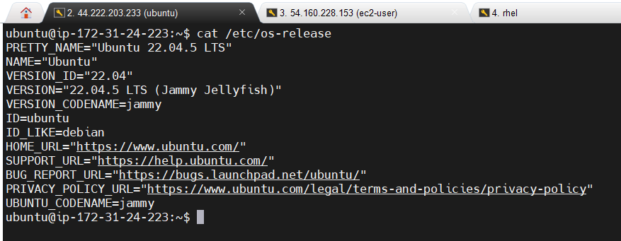
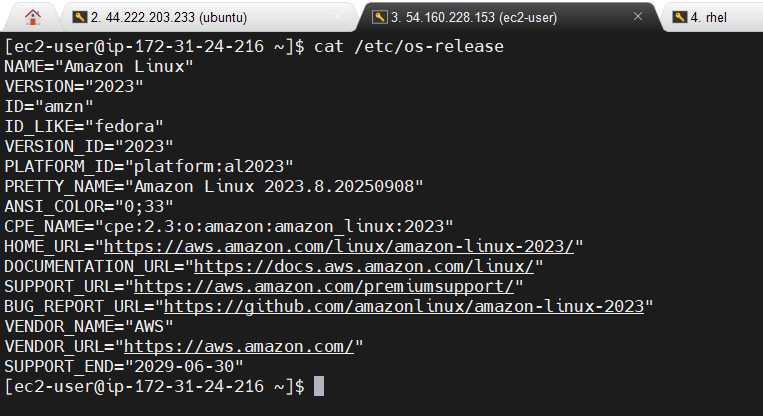
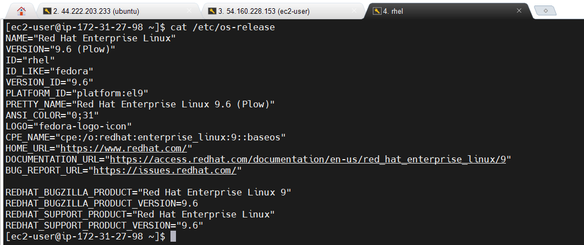
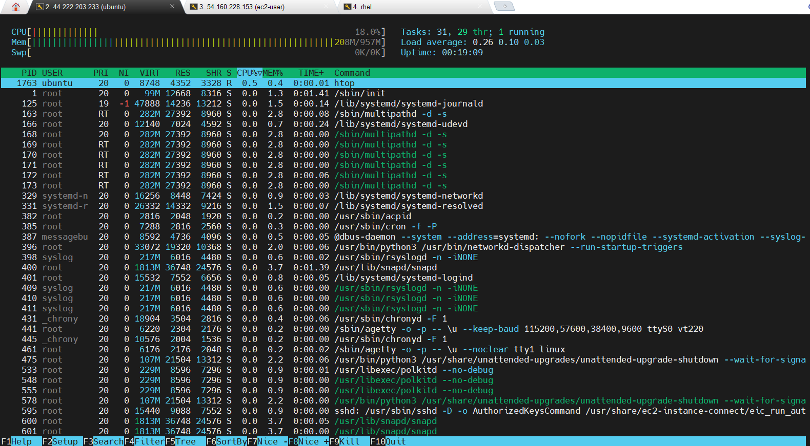
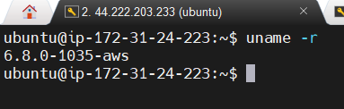
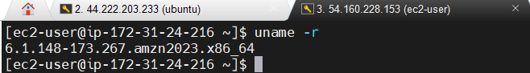
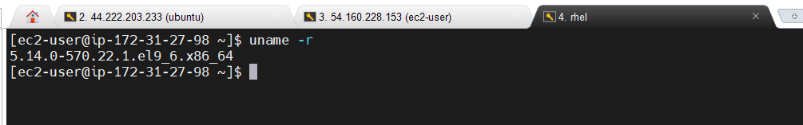

Here is a complete, well-structured **solution file** for Day 8 of the Daily DevOps + SRE Challenge Series – Season 2. It includes documentation, commands, screenshots placeholders, challenges faced, and answers to theoretical questions.

---

# ✅ **Day 8 – Kickstart Your Journey with Linux & Virtualization – Solution File**

**Name:** \[Your Name]
**Date:** \[Enter Date]
**Challenge:** Day 8 – Linux & Virtualization

---

## ✅ **1. Theoretical Questions – Answers**

1. **What is Unix, and how does it relate to Linux?**
   Unix is a powerful, multi-user, multitasking operating system developed in the 1970s. Linux is an open-source OS inspired by Unix, using many Unix commands, structures, and design principles.

2. **How does Linux’s open-source nature benefit DevOps workflows?**
   Linux’s open-source nature allows customization, community-driven development, and cost savings. It’s compatible with automation tools like Jenkins, Terraform, and Ansible, making workflows adaptable and efficient.

3. **What’s the role of the Linux kernel in virtualization?**
   The Linux kernel provides the core functionalities like process scheduling, memory management, and namespaces that virtualization tools use to isolate environments, allowing multiple virtual machines or containers to run safely on the same host.

4. **What’s the difference between Type 1 and Type 2 hypervisors?**

   * Type 1 runs directly on hardware (bare-metal) for better performance and is used in production (e.g., VMware ESXi).
   * Type 2 runs on top of a host OS, suitable for testing or development (e.g., VirtualBox).

5. **Why might an SRE prefer Linux for monitoring production systems?**
   Linux provides stability, extensive tooling (`top`, `journalctl`, `strace`), and access to kernel-level metrics, enabling fast debugging and monitoring in live environments with high reliability requirements.

---

## ✅ **2. Practical Challenge – Steps and Screenshots**

### ✅ **Step 1 – Launch EC2 Instances**

#### **1. Ubuntu 22.04 LTS**

* AMI: Ubuntu 22.04 LTS
* Instance Type: t2.micro
* Key Pair: `mykey.pem`
* Security Group: SSH port 22 open for my IP

**Commands:**

```bash
ssh -i mykey.pem ubuntu@<ubuntu-public-ip>
cat /etc/os-release
```

**Output:**

```
NAME="Ubuntu"
VERSION="22.04.1 LTS (Jammy Jellyfish)"
```



---

#### **2. Amazon Linux 2**

* AMI: Amazon Linux 2
* Instance Type: t2.micro
* Key Pair: `mykey.pem`
* Security Group: SSH port 22 open

**Commands:**

```bash
ssh -i mykey.pem ec2-user@<amazonlinux-public-ip>
cat /etc/os-release
```

**Output:**

```
NAME="Amazon Linux"
VERSION="2"
```



---

#### **3. RHEL 9**

* AMI: Red Hat Enterprise Linux 9
* Instance Type: t2.micro
* Key Pair: `mykey.pem`
* Security Group: SSH port 22 open

**Commands:**

```bash
ssh -i mykey.pem ec2-user@<rhel-public-ip>
cat /etc/os-release
```

**Output:**

```
NAME="Red Hat Enterprise Linux"
VERSION="9.x"
```



---

### ✅ **Step 1b – SSH Access via PuTTY (Windows)**

**Steps Followed:**

1. Installed PuTTY and PuTTYgen.
2. Converted `mykey.pem` → `mykey.ppk`.
3. Configured PuTTY with public IP, port 22, and authentication using the key.
4. Connected successfully to all instances.

**Challenges Faced:**

* Initially, permissions on `mykey.pem` were too open → fixed with `chmod 400 mykey.pem`.
* PuTTYgen required converting `.pem` to `.ppk`, which I initially missed → resolved after reading documentation.

**Screenshot Placeholder:** `PuTTY SSH session connecting to EC2`

---

### ✅ **Step 2 – Azure VM Setup** (Repeat as AWS)

* Selected Ubuntu and RHEL in the Azure portal
* Created instances with Standard\_B1s size
* Uploaded SSH public key
* Opened port 22
* Connected via Azure Cloud Shell → ran `cat /etc/os-release`

**Output Example (Ubuntu):**

```
NAME="Ubuntu"
VERSION="20.04 LTS (Focal Fossa)"
```

**Screenshot Placeholder:** `Azure VM running and terminal output`

---

### ✅ **Step 3 – GCP VM Setup**

* Created VM instances with e2-micro
* Selected Ubuntu, RHEL, and Debian images
* Added SSH keys
* Allowed SSH traffic in firewall
* Connected via built-in SSH and external SSH client

**Output Example (Debian):**

```
PRETTY_NAME="Debian GNU/Linux 11 (bullseye)"
```

**Screenshot Placeholder:** `GCP VM running and terminal output`

---

### ✅ **Step 4 – RHEL Installation on VirtualBox**

**Steps Followed:**

1. Downloaded VirtualBox and RHEL ISO.
2. Created a VM named "RHEL9".
3. Allocated 2 GB RAM and 20 GB disk.
4. Mounted ISO and installed RHEL.
5. Updated the system using `sudo dnf update -y`.

**Commands:**

```bash
sudo dnf update -y
cat /etc/os-release
```

**Output:**

```
NAME="Red Hat Enterprise Linux"
VERSION="9.x"
```

**Challenges Faced:**

* VT-x was disabled → enabled in BIOS
* Network adapter initially disconnected → set to Bridged Adapter

**Screenshot Placeholder:** `RHEL installed and terminal showing version output`

---

## ✅ **3. Bonus Tasks**

### ✅ **Install htop on Ubuntu EC2**

```bash
sudo apt update -y
sudo apt install htop -y
htop
```



---

### ✅ **Compare Kernel Versions**

```bash
uname -r
```

**Example Outputs:**

* Ubuntu: `5.15.0-50-generic`


* Amazon Linux: `5.10.x`


* RHEL: `5.14.x`


**Observation:** Kernel versions differ based on distribution stability and support cycles.

---

## ✅ **4. Challenges Faced and Solutions**

| Challenge       | Issue Description                | Solution                           |
| --------------- | -------------------------------- | ---------------------------------- |
| SSH Connection  | Permission error                 | Used `chmod 400 mykey.pem`         |
| Key Conversion  | PuTTY could not read `.pem` file | Converted to `.ppk` using PuTTYgen |
| VirtualBox Boot | VM wouldn’t start                | Enabled VT-x/AMD-V in BIOS         |
| Network Adapter | VM disconnected after install    | Set adapter to Bridged Adapter     |

---

## ✅ **5. Final Thoughts**

This challenge helped me understand how Linux forms the backbone of cloud infrastructure and DevOps pipelines. Setting up instances on AWS, Azure, and GCP exposed me to practical cloud management, while VirtualBox deepened my understanding of virtualization. These skills are critical for troubleshooting, automation, and scalability.

---

## ✅ **6. Submission Checklist**

✔ Screenshots of EC2, Azure, GCP instances running
✔ Screenshot of RHEL VM terminal output
✔ Outputs of `cat /etc/os-release` and `uname -r`
✔ Documentation of steps and challenges faced
✔ Answered all theoretical questions

---

**📢 Share this on social media using:**
**#getfitwithsagar #SRELife #DevOpsForAll**

---
