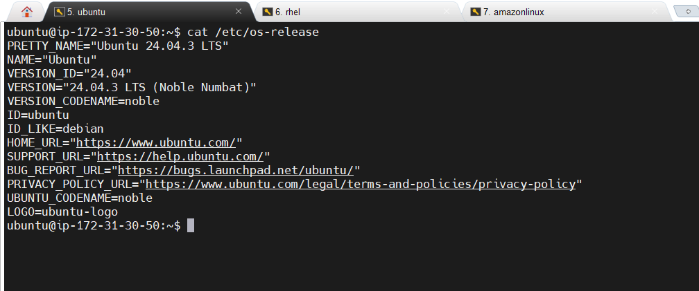
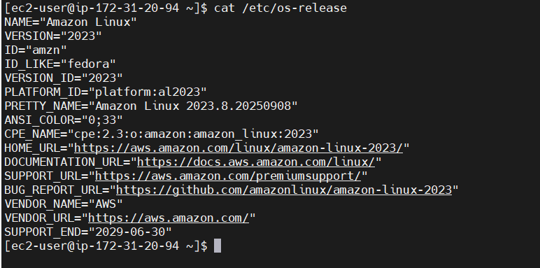
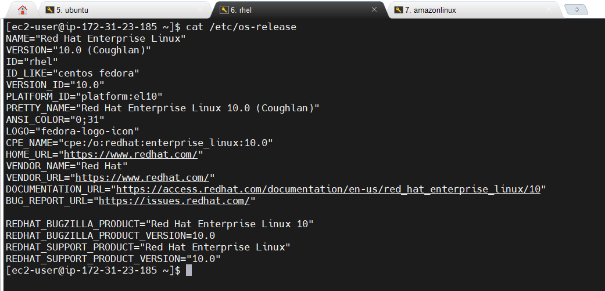
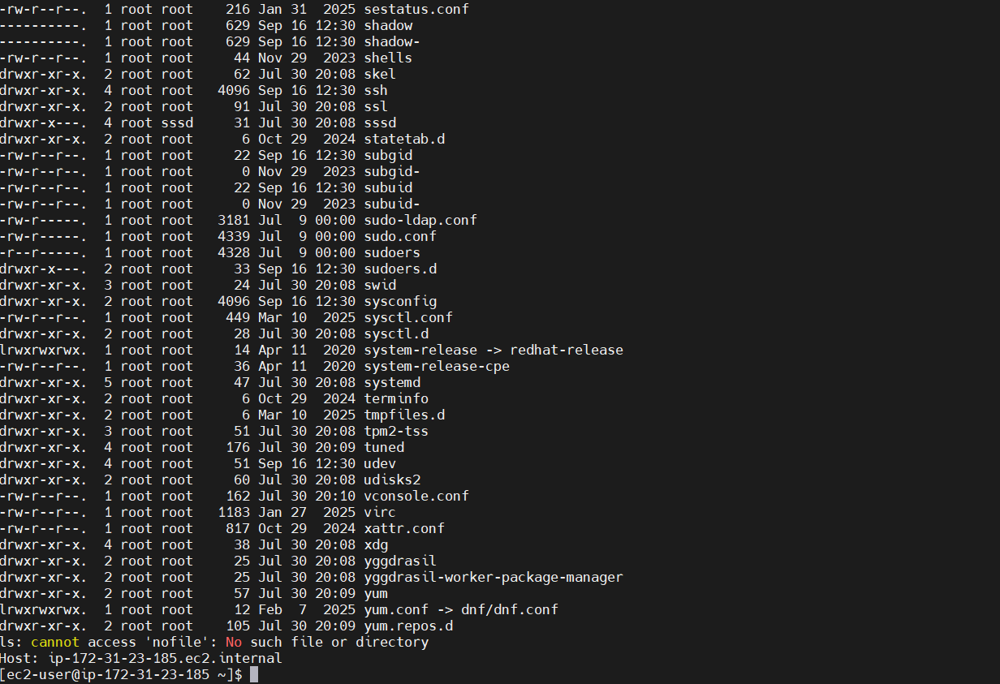
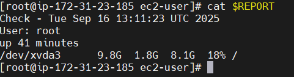
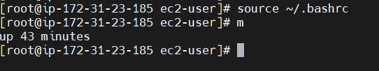
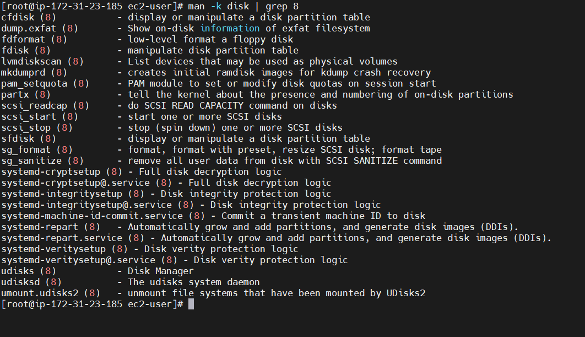
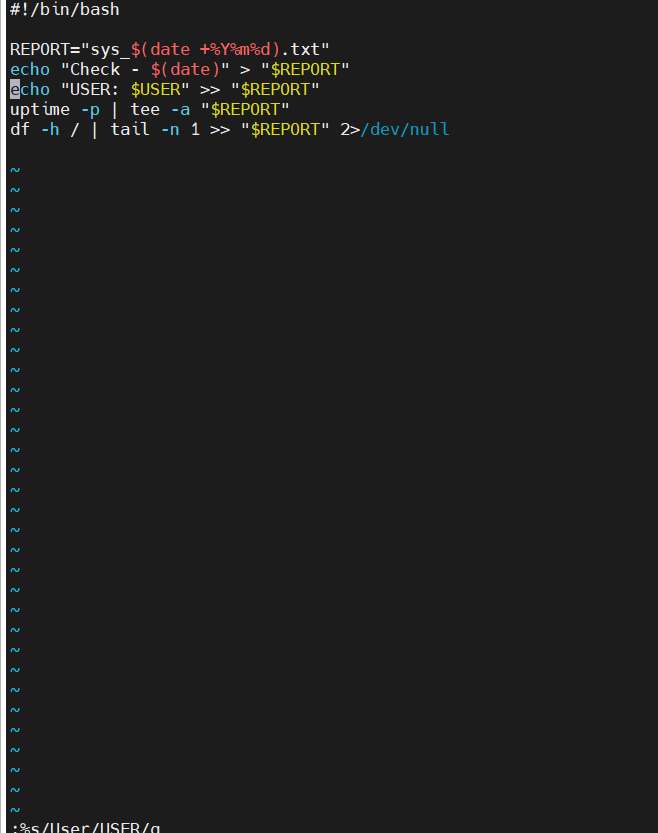

---

# ✅ **Day 9 – Mastering the Linux Shell – Solution File**

**Name:** Swayam Prakash Bhuyan
**Date:** 16-September-2025
**Challenge:** Day 9 – Linux Shell

---

## ✅ **1. Theoretical Questions – Answers**

### 1️⃣ How does the shell bridge applications and the kernel?

The shell interprets user commands and translates them into **system calls** that the kernel executes. It acts as an intermediary:

* **Applications** issue commands to the shell.
* **Shell** parses commands, manages input/output, and invokes the kernel.
* **Kernel** interacts with hardware to perform tasks (file operations, process management).

**Example:** `echo "hello" > file.txt`

1. Shell parses `echo` and `>`
2. Library functions handle string formatting
3. Kernel writes the data to disk

---

### 2️⃣ Explain `2>&1` vs `2> file` with an example

* `2> file`: Redirect **STDERR** to a file.
* `2>&1`: Merge **STDERR** with **STDOUT**, sending both to the same destination.

**Example:**

```bash
ls /nofile > out.txt 2> err.txt  # Separate outputs
ls /nofile > all.txt 2>&1        # Merge STDOUT & STDERR
```

---

### 3️⃣ Why does `myscript` fail but `./myscript` work?

The shell searches directories in `$PATH` to find executables. If the **current directory (`.`)** is not in `$PATH`, running `myscript` alone fails. Using `./myscript` explicitly runs the script from the current directory.

---

### 4️⃣ How does `history -c; history -w` differ from `history -c` alone?

* `history -c`: Clears **in-memory history** only.
* `history -c; history -w`: Clears **memory history** and writes the empty history to the file (`~/.bash_history`), permanently erasing past commands.

---

### 5️⃣ Why is `/etc/motd` useful for admins but not GUI users?

`/etc/motd` displays **post-login messages** for shell/SSH users, such as maintenance notices. GUI users rarely use shell login, so they won’t see these messages.

---

## ✅ **2. Practical Challenge – Steps and Screenshots**

### Step 1 – SSH into EC2 Instances

#### 1️⃣ Ubuntu 22.04 LTS

```bash
ssh -i mykey.pem ubuntu@<ubuntu-public-ip>
cat /etc/os-release
```

**Output:**



---

#### 2️⃣ Amazon Linux 2

```bash
ssh -i mykey.pem ec2-user@<amazonlinux-public-ip>
cat /etc/os-release
```

**Output:**



---

#### 3️⃣ RHEL 9

```bash
ssh -i mykey.pem ec2-user@<rhel-public-ip>
cat /etc/os-release
```

**Output:**



---

### Step 2 – Shell Commands, Redirection, and Piping

```bash
type ls                   # Check if alias or binary
ls -l /etc > out.txt      # Redirect STDOUT
ls nofile 2> err.txt      # Redirect STDERR
cat out.txt err.txt > combined.txt 2>&1  # Merge outputs
echo "Host: $(hostname)" >> combined.txt
ls -R / | grep "bin" | less  # Pipe chain
history -d 2              # Delete 2nd command from history
```



---

### Step 3 – Bash Scripting and Vim on RHEL VM

1. Boot RHEL VM and log in.
2. Create script:

```bash
vim ~/monitor.sh
```

3. Script content:

```bash
#!/bin/bash
export REPORT="sys_$(date +%Y%m%d).txt"
echo "Check - $(date)" > "$REPORT"
echo "User: $USER" >> "$REPORT"
uptime -p | tee -a "$REPORT"
df -h / | tail -n 1 >> "$REPORT" 2>/dev/null
```

4. Edit and save in Vim: `Esc`, `:3` (line 3), `dd` (delete), `u` (undo), `:wq` (save & quit).
5. Make executable and run:

```bash
chmod +x monitor.sh
./monitor.sh
cat "$REPORT"
```



6. Persist alias:

```bash
echo "alias m='./monitor.sh'" >> ~/.bashrc
source ~/.bashrc
```



---

### Step 4 – Bonus Tasks

**1️⃣ Help Hunt**

```bash
man -k disk | grep 8
```



---

**2️⃣ Vim Swap**

```vim
:%s/User/USER/g
```



---

## ✅ **3. Challenges Faced and Solutions**

| Challenge            | Issue Description                  | Solution                           |
| -------------------- | ---------------------------------- | ---------------------------------- |
| Command not found    | `$PATH` didn’t include current dir | Use `./myscript`                   |
| History persistence  | Only in-memory cleared             | Used `history -c; history -w`      |
| Vim editing mistakes | Stuck in wrong mode                | Press Esc and use correct commands |
| Script permissions   | `Permission denied`                | `chmod +x monitor.sh`              |

---

## ✅ **4. Final Thoughts**

This challenge enhanced my understanding of Linux shell concepts:

* I/O redirection, piping, and STDIN/STDOUT/STDERR management.
* Bash scripting and automation with `monitor.sh`.
* Vim basics for fast file editing.
* Environment variables and aliases for customized workflows.

These skills are critical for **DevOps automation**, **SRE incident response**, and **cloud system management**.

---

## ✅ **5. Submission Checklist**

✔ Screenshots of EC2 terminals with combined.txt content
✔ Screenshot of RHEL VM sys\_\*.txt output
✔ Bonus tasks outputs (help hunt & Vim substitution)
✔ Documented commands, steps, and troubleshooting notes
✔ Answers to all theoretical questions

---

**📢 Share on social media using:**
**#getfitwithsagar #SRELife #DevOpsForAll**

---

